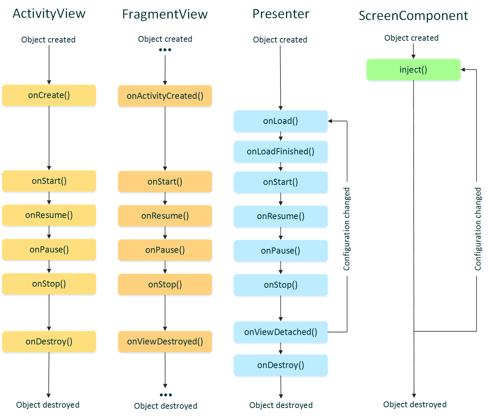

#Ferro

Simple and powerful MVP library for Android 

Ferro elegantly solves two age-old problems of Android Framework related to configuration changes:
* restore screen's data
* managing background tasks

First problem solved using permanent presenter, second - using freezing rx events (Observable doesn't unsubscribe).
Also new feature added - freeze rx event when screen becomes invisible, and defreeze it when screen goes to foreground.

The schematic work of ferro:


Ferro is divided into 3 layers, each of which adds behavior to the previous. So you can use only part of ferro.

The first layer:
##ferro-core
This library contains base classes for Activity and Fragment (`PSSActivity, PSSFragmentV4`, PSS - persistent screen scope). For each activity and fragment, based on this classes, will be created `PersistentScreenScope`.  You can get it by calling the method `PSSActivity#getPersistentScreenScope` or `PSSFragmentV4#getPersistentScreenScope`. This object isn't destroyed, when configuration changed, and destroyed when screen finally destroyed(e.g. after call `Activity#finish()`). You can add listener, which called when `PersistentScreenScope` destroyed. It has methods for storing and getting objects.
In reality, `PersistentScreenScope` is retained fragment without view.

This mechanism is ideal for storing presenter, that is done in the next extention:
##ferro-mvp
This library contains base classes for view, presenter and screen component. For each screen you need to extend `ScreenComponent`, `MvpPresenter` and `MvpActivityView` or `MvpFragmentV4View`. 

The `ScreenComponent` will be saved in `PersistentScreenScope` and reused when view recreated. In method `ScreenComponent#inject(view)` you need to insert presenter to the view. For this purpose the easiest way to use dagger component as `ScreenComponent`. Due to this mechanism presenter is reused after configuration change. 

Method `MvpPresenter#onLoad(viewRecreated)` will be called, when view is ready, flag `viewRecreated` means, that view is recreated after configuration change. In this method you should show on view previously loaded data if it exist.

In `MvpActivityView` you should override method `#onCreate()` with parameter `viewRecreated` instead of standard method `#onCreate()`. Same for `MvpFragmentV4View` and `onActivityCreated` method.

If you use dagger, this library contains two scope annotations `@PerApplication` and `@PerScreen`. It also contains `ActivityProvider` and `FragmentProvider`, which can be used for getting access to Activity or Fragment inside objects, provided by dagger screen component (e.g. inside Navigator class).

It's lifecycle of screen's objects: 


The next extention add freeze logic for Rx events:
##ferro-mvp-rx
Class `MvpRxPesenter` contains freeze logic, scematic work of which shown in gif above. This class should extend instead `MvpPresenter`

If subscribe to `Observable` via one of `MvpRxPesenter#subscribe()` method,
all rx events (onNext, onError, onComplete) would be frozen when view destroyed and unfrozen
when view recreated.
If option freezeEventOnPause enabled (default enabled), all Rx events
would be also frozen when screen paused and unfrozen when screen resumed.

When screen finally destroyed, all subscriptions would be automatically unsubscribed.

##ferro-rx
This library contains one rx operator (`OperatorFreeze`), which contains freeze logic. For apply it, you should pass this operator in method `Observable#lift()`.
If you want to create own base classes for View and Presenter, you can use only `ferro-core` for saving presenter and `ferro-rx` for append freeze logic.

## License
```
Copyright 2016 Maxim Tuev

   Licensed under the Apache License, Version 2.0 (the "License");
   you may not use this file except in compliance with the License.
   You may obtain a copy of the License at

       http://www.apache.org/licenses/LICENSE-2.0

   Unless required by applicable law or agreed to in writing, software
   distributed under the License is distributed on an "AS IS" BASIS,
   WITHOUT WARRANTIES OR CONDITIONS OF ANY KIND, either express or implied.
   See the License for the specific language governing permissions and
   limitations under the License.
```


